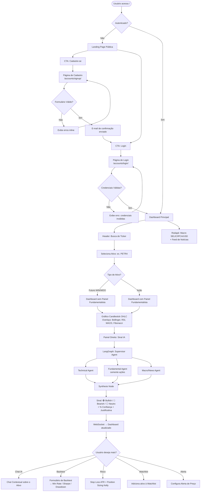

# PRD — Trade Intelligence B3
### Product Requirements Document v1.0
> Autor: Arquiteto de Software Sênior | Data: 2026-06-28 | Status: **Aprovado para Implementação**

---

## 1. Visão Geral

**Trade Intelligence B3** é uma aplicação web Django full-stack voltada à análise preditiva de ativos da bolsa brasileira (B3), cobrindo contratos futuros Mini Índice (WIN) e Mini Dólar (WDO) e qualquer ação negociada na B3 via busca livre por ticker. O sistema combina análise técnica automatizada (indicadores, padrões gráficos, Fibonacci), dados macroeconômicos (SELIC, IPCA, PIB via API BCB) e análise de sentimento de notícias para emitir sinais preditivos direcionais (Bullish / Bearish / Neutro) com justificativa estruturada — posicionando a IA como co-piloto do trader em decisões manuais.

---

## 2. Sobre o Produto

**Trade Intelligence B3** é uma ferramenta de suporte à decisão para traders individuais. Ela agrega, processa e apresenta múltiplas dimensões de análise de mercado em um único dashboard. A coleta de dados é assíncrona (via Celery + Redis), o processamento de análise é desencadeado automaticamente após cada inserção de dados novos, e os resultados são exibidos em tempo real no frontend via WebSocket. A interface expõe gráficos de candlestick interativos (TradingView Lightweight Charts), painéis de sinal IA, backtesting simplificado, chat contextual e gestão de risco básica.

---

## 3. Propósito

**Problema Central**: Traders de varejo operam com acesso fragmentado à informação — gráficos em uma plataforma, notícias em outra, dados macro em planilhas, fundamentos em sites separados. A análise integrada é manual, lenta e suscetível a viés cognitivo.

**Solução**: Centralizar a coleta, o processamento e a apresentação de todas as dimensões analíticas relevantes em um único dashboard, com um sistema multi-agente que sintetiza os dados e emite um sinal direcional fundamentado — reduzindo o tempo de análise do trader de horas para minutos.

---

## 4. Público-Alvo

| Perfil | Descrição |
|---|---|
| **Usuário primário (MVP)** | Trader individual pessoa física, operando Mini Índice/Dólar ou ações da B3 |
| **Nível técnico** | Usuário que conhece análise técnica básica (sabe ler candlestick, RSI, MACD) |
| **Necessidade** | Confirmar ou contestar sua própria leitura de mercado com dados adicionais |
| **Usuário futuro (SaaS)** | Múltiplos traders em plano multi-tenant com isolamento de dados |

---

## 5. Objetivos

1. **Sinal Preditivo Confiável**: Emitir sinal direcional (Bullish/Bearish/Neutro) com percentual de confiança e justificativa multi-dimensional para qualquer ativo coberto.
2. **Coleta Automatizada de Dados**: Ingerir OHLC, fundamentos, macro e notícias de forma autônoma via Celery Beat, sem intervenção manual.
3. **Dashboard Centralizado**: Apresentar gráfico de candlestick interativo, sinal IA, dados fundamentalistas e indicadores macro em uma única interface coesa.
4. **Backtest Integrado**: Permitir simulação de estratégias simples sobre dados históricos, retornando Win Rate, Sharpe Ratio e Max Drawdown.
5. **Arquitetura Preparada para SaaS**: Estrutura multi-tenant com isolamento por schema PostgreSQL, pronta para evolução do MVP pessoal para produto comercial.

---

## 6. Requisitos Funcionais

### RF-01 — Autenticação e Cadastro
- RF-01.1: Cadastro de novo usuário com e-mail e senha (Django Allauth).
- RF-01.2: Login com e-mail e senha, redirecionamento automático para dashboard.
- RF-01.3: Logout com invalidação de sessão.
- RF-01.4: Recuperação de senha por e-mail.

### RF-02 — Landing Page Pública
- RF-02.1: Página inicial pública com apresentação do produto, CTAs "Cadastre-se" e "Login".
- RF-02.2: Usuário autenticado é redirecionado ao dashboard automaticamente ao acessar "/".

### RF-03 — Dashboard Principal
- RF-03.1: Header com campo de busca de ticker, lista de watchlist, ícone de alertas e menu de perfil.
- RF-03.2: Painel esquerdo com gráfico de candlestick interativo (TradingView Lightweight Charts), suporte a overlay de Bollinger Bands, MACD, RSI e níveis de Fibonacci.
- RF-03.3: Painel direito com card de Sinal IA (Bullish/Bearish/Neutro, % de confiança, justificativa textual por agente).
- RF-03.4: Painel direito com sub-seção de dados fundamentalistas (visível apenas para ações, oculto para WIN/WDO).
- RF-03.5: Rodapé fixo com tickers de indicadores macro (SELIC, IPCA, USD/BRL) e feed de últimas notícias do ativo selecionado.

### RF-04 — Gestão de Ativos e Watchlist
- RF-04.1: Busca livre de ativo por ticker (ex: PETR4, WIN, WDO).
- RF-04.2: Adição e remoção de ativos à Watchlist do usuário.
- RF-04.3: Persistência da watchlist por usuário (isolada por tenant em produção SaaS).

### RF-05 — Coleta de Dados (Celery Tasks)
- RF-05.1: Task `fetch_intraday_ohlc` — coleta OHLC 1min (WIN/WDO) via Brapi.dev/TrydAPI, agendada a cada 1 minuto durante pregão.
- RF-05.2: Task `fetch_daily_ohlc` — coleta OHLC diário (ações) via yfinance, agendada a cada 1h durante pregão.
- RF-05.3: Task `fetch_macro_data` — coleta indicadores BCB (SELIC, IPCA, PIB), agendada a cada 2h.
- RF-05.4: Task `fetch_fundamentals` — coleta dados fundamentalistas via Fundamentus (scraping httpx+BeautifulSoup) + Brapi.dev, agendada a cada 24h.
- RF-05.5: Task `fetch_news` — coleta notícias via Investing.com (scraping) com fallback para NewsAPI, agendada a cada 24h.
- RF-05.6: Ao término de cada inserção de OHLC, disparar task `run_technical_analysis` para o ticker inserido.

### RF-06 — Análise Técnica
- RF-06.1: Cálculo de RSI, MACD e Bollinger Bands sobre a série OHLC armazenada.
- RF-06.2: Detecção de padrões de candlestick via TA-Lib.
- RF-06.3: Cálculo de níveis de Fibonacci sobre os máximos/mínimos do período.
- RF-06.4: Persistência dos resultados calculados no banco de dados.

### RF-07 — Sistema de Sinais IA (LangGraph)
- RF-07.1: Supervisor Agent recebe ticker + tipo de ativo e decide quais sub-agentes acionar.
- RF-07.2: Technical Agent consome OHLC, indicadores e padrões e gera análise técnica textual.
- RF-07.3: Fundamental Agent (somente ações) consome P/L, ROE, DY, EV/EBITDA e gera análise fundamentalista.
- RF-07.4: Macro/News Agent consome indicadores macro e sentimento de notícias e gera análise macro textual.
- RF-07.5: Synthesis Node consolida as análises e emite sinal final com % de confiança.
- RF-07.6: Resultado do sinal é publicado via WebSocket no canal do ativo e armazenado no banco.

### RF-08 — Chat IA
- RF-08.1: Interface de chat contextual no dashboard onde o usuário faz perguntas livres sobre o ativo.
- RF-08.2: O LLM responde usando os dados reais armazenados (OHLC, fundamentos, macro, notícias) como contexto.

### RF-09 — Backtest
- RF-09.1: Formulário de configuração de backtest: ticker, período (data início/fim), estratégia (lista predefinida), capital inicial.
- RF-09.2: Execução do backtest via `backtesting.py`, retornando Win Rate, Sharpe Ratio e Max Drawdown.
- RF-09.3: Exibição dos resultados em painel dedicado no dashboard.

### RF-10 — Gestão de Risco
- RF-10.1: Cálculo de Stop Loss sugerido baseado em ATR (Average True Range) do ativo.
- RF-10.2: Cálculo de position sizing usando fórmula de Kelly simplificada com capital informado pelo usuário.
- RF-10.3: Exibição em card dedicado no painel direito do dashboard.

### RF-11 — Alertas
- RF-11.1: Usuário pode configurar alerta de preço (acima/abaixo de valor) para qualquer ativo da watchlist.
- RF-11.2: Alerta disparado quando condição é satisfeita (notificação in-app via WebSocket).

---

### Fluxo de UX



---

## 7. Requisitos Não-Funcionais

### RNF-01 — Performance
- RNF-01.1: Tempo de carregamento inicial do dashboard ≤ 3s (LCP) em conexão 4G simulada.
- RNF-01.2: Atualização de sinal IA via WebSocket ≤ 30s após nova inserção de OHLC.
- RNF-01.3: Queries de séries temporais sobre hypertables TimescaleDB com resposta ≤ 500ms para janelas de até 30 dias.
- RNF-01.4: Cache de resultados LLM no Redis por no mínimo 5 minutos por ticker.

### RNF-02 — Disponibilidade e Confiabilidade
- RNF-02.1: Tasks Celery com retry automático em caso de falha (max 3 tentativas, backoff exponencial).
- RNF-02.2: Fallback de NewsAPI acionado automaticamente se Investing.com bloquear scraping.
- RNF-02.3: Rollover automático de contratos WIN/WDO no `market_data` app.

### RNF-03 — Segurança
- RNF-03.1: Todas as rotas do sistema (exceto landing page, login e cadastro) exigem autenticação Django.
- RNF-03.2: Proteção CSRF nativa do Django habilitada em todos os forms.
- RNF-03.3: Secrets e API keys carregadas exclusivamente via variáveis de ambiente (`.env`).
- RNF-03.4: Rate limiting via `django-ratelimit` nas rotas de autenticação.
- RNF-03.5: HTTPS obrigatório em produção (nginx + Let's Encrypt).

### RNF-04 — Padrões de Código
- RNF-04.1: Todo código Python 100% em inglês (nomes de classes, variáveis, funções, arquivos).
- RNF-04.2: Conformidade estrita com PEP 8.
- RNF-04.3: Uso de aspas simples (`'`) em todo código Python, exceto quando a string contenha aspas simples internas.
- RNF-04.4: Uso obrigatório de Class-Based Views (CBVs) do Django. Proibido uso de function-based views, salvo casos excepcionais documentados.
- RNF-04.5: Uso obrigatório de classes `forms.Form` ou `forms.ModelForm` para qualquer formulário.
- RNF-04.6: Todos os models Django devem conter `created_at = models.DateTimeField(auto_now_add=True)` e `updated_at = models.DateTimeField(auto_now=True)`.
- RNF-04.7: Sinais Django devem residir exclusivamente em arquivo `signals.py` dentro do respectivo app.
- RNF-04.8: Interface do usuário 100% em Português Brasileiro (PT-BR), incluindo labels, mensagens de erro e notificações.

### RNF-05 — Ambiente de Desenvolvimento
- RNF-05.1: Banco de dados: SQLite nas sprints 1–4. PostgreSQL + TimescaleDB a partir da sprint 5.
- RNF-05.2: Docker e Testes Automatizados alocados exclusivamente nas sprints finais (8 e 9).
- RNF-05.3: Servidor Linux (VPS/Cloud) para ambiente de produção.

---

## 8. Arquitetura Técnica

### 8.1 Stack Tecnológica

| Camada | Tecnologia | Versão Alvo |
|---|---|---|
| Backend Framework | Django | 5.x |
| Task Queue | Celery + Redis (broker + cache) | Celery 5.x / Redis 7.x |
| Banco (dev) | SQLite | nativo Django |
| Banco (prod) | PostgreSQL + TimescaleDB | PG 16 / TS 2.x |
| Real-time | Django Channels + WebSocket | Channels 4.x |
| Agentes IA | LangGraph + LangChain | Latest stable |
| LLM | Gemini 1.5 Pro ou GPT-4o (configurável via env) | — |
| Frontend Charts | TradingView Lightweight Charts | 4.x |
| Frontend Interatividade | HTMX + Alpine.js | HTMX 2.x / Alpine 3.x |
| CSS | TailwindCSS (via CDN ou build) | 3.x |
| Análise Técnica | TA-Lib + pandas-ta | — |
| Backtest | backtesting.py | — |
| Multi-tenant (futuro) | django-tenants | — |
| Autenticação | Django Allauth | — |
| HTTP scraping | httpx + BeautifulSoup4 | — |

### 8.2 Estrutura de Apps Django

```
trade_intelligence/          ← Projeto Django (settings, urls, wsgi, asgi)
├── core/                    ← Configurações globais, middlewares, context processors
├── accounts/                ← Auth: CBVs de login, cadastro, logout (Allauth)
├── market_data/             ← Models OHLC, Celery tasks de coleta, rollover
├── analysis/                ← Indicadores técnicos, padrões, Fibonacci, signals
├── ai_agents/               ← LangGraph workflows, tools, supervisor, synthesis
├── backtest/                ← Engine backtesting.py, models de resultado
├── risk/                    ← Position sizing, stop loss ATR, models
├── news/                    ← Scraping notícias, sentimento, models
├── fundamentals/            ← Scraping Fundamentus, scoring, models
├── watchlist/               ← Models Watchlist e Alert por usuário
└── dashboard/               ← Views principais, WebSocket consumers, templates
```

---

### 8.3 Schema de Dados (ERD)

```mermaid
erDiagram
    AUTH_USER {
        int id PK
        string username
        string email
        string password
        bool is_active
        datetime created_at
        datetime updated_at
    }

    ASSET {
        int id PK
        string ticker UK
        string name
        string asset_type
        string exchange
        datetime created_at
        datetime updated_at
    }

    OHLC_CANDLE {
        int id PK
        int asset_id FK
        string timeframe
        datetime timestamp
        decimal open
        decimal high
        decimal low
        decimal close
        bigint volume
        datetime created_at
        datetime updated_at
    }

    TECHNICAL_INDICATOR {
        int id PK
        int asset_id FK
        string indicator_name
        string timeframe
        datetime timestamp
        json values
        datetime created_at
        datetime updated_at
    }

    CANDLESTICK_PATTERN {
        int id PK
        int asset_id FK
        string pattern_name
        string timeframe
        datetime timestamp
        string direction
        decimal confidence
        datetime created_at
        datetime updated_at
    }

    FUNDAMENTAL_DATA {
        int id PK
        int asset_id FK
        date reference_date
        decimal pl_ratio
        decimal roe
        decimal dividend_yield
        decimal ev_ebitda
        json raw_data
        datetime created_at
        datetime updated_at
    }

    MACRO_INDICATOR {
        int id PK
        string name
        string source
        date reference_date
        decimal value
        string unit
        datetime created_at
        datetime updated_at
    }

    NEWS_ARTICLE {
        int id PK
        int asset_id FK
        string title
        text body
        string source_url
        string source_name
        string sentiment
        decimal sentiment_score
        datetime published_at
        datetime created_at
        datetime updated_at
    }

    AI_SIGNAL {
        int id PK
        int asset_id FK
        string signal_type
        decimal confidence_pct
        text technical_justification
        text fundamental_justification
        text macro_justification
        text synthesis_text
        string timeframe
        datetime generated_at
        datetime created_at
        datetime updated_at
    }

    BACKTEST_RESULT {
        int id PK
        int user_id FK
        int asset_id FK
        string strategy_name
        date start_date
        date end_date
        decimal initial_capital
        decimal final_capital
        decimal win_rate
        decimal sharpe_ratio
        decimal max_drawdown
        json trades_log
        datetime created_at
        datetime updated_at
    }

    WATCHLIST {
        int id PK
        int user_id FK
        int asset_id FK
        int display_order
        datetime created_at
        datetime updated_at
    }

    PRICE_ALERT {
        int id PK
        int user_id FK
        int asset_id FK
        string condition
        decimal target_price
        bool is_active
        bool is_triggered
        datetime triggered_at
        datetime created_at
        datetime updated_at
    }

    RISK_CALCULATION {
        int id PK
        int user_id FK
        int asset_id FK
        decimal atr_value
        decimal suggested_stop_loss
        decimal user_capital
        decimal position_size
        decimal kelly_fraction
        datetime created_at
        datetime updated_at
    }

    AUTH_USER ||--o{ WATCHLIST : "possui"
    AUTH_USER ||--o{ PRICE_ALERT : "configura"
    AUTH_USER ||--o{ BACKTEST_RESULT : "executa"
    AUTH_USER ||--o{ RISK_CALCULATION : "calcula"

    ASSET ||--o{ OHLC_CANDLE : "tem"
    ASSET ||--o{ TECHNICAL_INDICATOR : "tem"
    ASSET ||--o{ CANDLESTICK_PATTERN : "tem"
    ASSET ||--o{ FUNDAMENTAL_DATA : "tem"
    ASSET ||--o{ NEWS_ARTICLE : "tem"
    ASSET ||--o{ AI_SIGNAL : "gera"
    ASSET ||--o{ WATCHLIST : "aparece em"
    ASSET ||--o{ PRICE_ALERT : "monitora"
    ASSET ||--o{ BACKTEST_RESULT : "usado em"
    ASSET ||--o{ RISK_CALCULATION : "calculado para"
```



---

## 9. Design System

> Interface 100% em Português Brasileiro. Dark mode nativo. Paleta de cores harmônica com gradientes.

### 9.1 Paleta de Cores

| Token | Descrição | Hex | Classe TailwindCSS |
|---|---|---|---|
| `--color-bg-primary` | Fundo principal | `#0A0E1A` | `bg-[#0A0E1A]` |
| `--color-bg-surface` | Cards e painéis | `#111827` | `bg-gray-900` |
| `--color-bg-elevated` | Hover / modais | `#1F2937` | `bg-gray-800` |
| `--color-border` | Bordas sutis | `#374151` | `border-gray-700` |
| `--color-primary` | Azul elétrico (ações primárias) | `#3B82F6` | `bg-blue-500` |
| `--color-primary-hover` | Hover do primário | `#2563EB` | `hover:bg-blue-600` |
| `--color-accent` | Ciano (destaque/gradiente) | `#06B6D4` | `text-cyan-400` |
| `--color-bullish` | Sinal Bullish | `#10B981` | `text-emerald-400` |
| `--color-bearish` | Sinal Bearish | `#EF4444` | `text-red-400` |
| `--color-neutral` | Sinal Neutro | `#9CA3AF` | `text-gray-400` |
| `--color-text-primary` | Texto principal | `#F9FAFB` | `text-gray-50` |
| `--color-text-secondary` | Texto secundário | `#9CA3AF` | `text-gray-400` |
| `--color-text-muted` | Texto desabilitado | `#6B7280` | `text-gray-500` |
| `--gradient-header` | Gradiente do header | `#1E3A5F → #0A0E1A` | `from-[#1E3A5F] to-[#0A0E1A]` |
| `--gradient-signal-bullish` | Gradiente card bullish | `#064E3B → #065F46` | `from-emerald-900 to-emerald-800` |
| `--gradient-signal-bearish` | Gradiente card bearish | `#7F1D1D → #991B1B` | `from-red-900 to-red-800` |

### 9.2 Tipografia

| Elemento | Fonte | Classe TailwindCSS |
|---|---|---|
| Fonte base | Inter (Google Fonts) | `font-sans` (customizado para Inter) |
| Título de página (h1) | Inter 700 / 2rem | `text-3xl font-bold tracking-tight` |
| Título de seção (h2) | Inter 600 / 1.5rem | `text-2xl font-semibold` |
| Card title (h3) | Inter 600 / 1.125rem | `text-lg font-semibold` |
| Body / paragráfo | Inter 400 / 0.875rem | `text-sm font-normal` |
| Caption / label | Inter 400 / 0.75rem | `text-xs text-gray-400` |
| Ticker / dado numérico | Inter Mono 600 | `font-mono font-semibold tabular-nums` |

### 9.3 Botões

| Variante | Uso | Classes TailwindCSS |
|---|---|---|
| **Primary** | Ação principal (Analisar, Cadastrar) | `bg-blue-500 hover:bg-blue-600 text-white font-semibold px-4 py-2 rounded-lg transition-colors duration-200` |
| **Secondary** | Ação secundária (Cancelar, Voltar) | `bg-gray-700 hover:bg-gray-600 text-gray-100 font-medium px-4 py-2 rounded-lg transition-colors duration-200` |
| **Danger** | Ações destrutivas (Remover alerta) | `bg-red-700 hover:bg-red-600 text-white font-medium px-4 py-2 rounded-lg transition-colors duration-200` |
| **Ghost** | Ações terciárias (links no nav) | `text-gray-400 hover:text-white hover:bg-gray-800 px-3 py-2 rounded-md transition-all duration-200` |
| **Icon Button** | Botões com apenas ícone | `p-2 rounded-full bg-gray-800 hover:bg-gray-700 text-gray-300 hover:text-white transition-colors duration-200` |

### 9.4 Inputs e Formulários

```
<input>: bg-gray-800 border border-gray-700 text-gray-100 placeholder-gray-500
         rounded-lg px-3 py-2 text-sm focus:outline-none focus:ring-2 focus:ring-blue-500
         focus:border-blue-500 transition-all duration-200 w-full

<select>: bg-gray-800 border border-gray-700 text-gray-100 rounded-lg px-3 py-2
          text-sm focus:ring-2 focus:ring-blue-500 w-full

<label>: block text-xs font-medium text-gray-400 mb-1 uppercase tracking-wide

Erro inline: text-red-400 text-xs mt-1

Form container: bg-gray-900 border border-gray-700 rounded-xl p-6 shadow-xl
```

### 9.5 Cards e Painéis

```
Card base: bg-gray-900 border border-gray-700/50 rounded-xl p-5 shadow-lg

Card Sinal Bullish: bg-gradient-to-br from-emerald-900/40 to-emerald-800/20
                   border border-emerald-700/50 rounded-xl p-5

Card Sinal Bearish: bg-gradient-to-br from-red-900/40 to-red-800/20
                   border border-red-700/50 rounded-xl p-5

Card Sinal Neutro: bg-gradient-to-br from-gray-800/40 to-gray-700/20
                  border border-gray-600/50 rounded-xl p-5
```

### 9.6 Layout / Grid

| Breakpoint | Comportamento |
|---|---|
| Mobile (< 768px) | Layout em coluna única. Gráfico em topo, painel IA abaixo |
| Tablet (768–1280px) | Grid 2 colunas (8/4) |
| Desktop (> 1280px) | Grid 3 colunas (6/3/3) — Gráfico | Sinal IA | Fundamentais / Risco |

```
Dashboard wrapper: min-h-screen bg-[#0A0E1A] flex flex-col
Header: w-full bg-gradient-to-r from-[#1E3A5F] to-[#0A0E1A] border-b border-gray-700/50
Main grid: grid grid-cols-1 lg:grid-cols-12 gap-4 p-4
Chart panel: lg:col-span-7 xl:col-span-8
Signal panel: lg:col-span-5 xl:col-span-4
Footer: w-full bg-gray-900 border-t border-gray-700/50 px-4 py-2
```

### 9.7 Navegação / Header

```
nav: flex items-center justify-between h-16 px-6
logo: text-xl font-bold bg-gradient-to-r from-blue-400 to-cyan-400 bg-clip-text text-transparent
search input: bg-gray-800/80 backdrop-blur-sm border border-gray-700 rounded-full
              px-4 py-1.5 text-sm w-64 focus:ring-1 focus:ring-blue-500
nav links: flex items-center gap-2
user avatar: w-8 h-8 rounded-full bg-gradient-to-br from-blue-500 to-cyan-500
             flex items-center justify-center text-white text-sm font-bold
```

---

## 10. User Stories

### Épico 1 — Autenticação e Acesso

---

**US-01 — Cadastro de novo usuário**
> **Como** trader, **quero** me cadastrar com e-mail e senha **para** ter acesso ao dashboard personalizado.

**Critérios de Aceite:**
- **Dado que** estou na landing page pública,
  **Quando** clico em "Cadastre-se" e preencho e-mail, senha e confirmação de senha com dados válidos e clico em "Criar conta",
  **Então** minha conta é criada, recebo e-mail de confirmação e sou redirecionado para a página de login.

- **Dado que** estou no formulário de cadastro,
  **Quando** submeto com um e-mail já cadastrado,
  **Então** o formulário exibe a mensagem de erro "Este e-mail já está em uso" inline no campo e-mail, sem recarregar a página.

---

**US-02 — Login**
> **Como** trader cadastrado, **quero** fazer login **para** acessar meu dashboard.

**Critérios de Aceite:**
- **Dado que** sou um usuário cadastrado e confirmado,
  **Quando** acesso `/accounts/login/`, insiro minhas credenciais válidas e clico em "Entrar",
  **Então** sou autenticado e redirecionado para `/dashboard/`.

- **Dado que** já estou autenticado,
  **Quando** acesso a URL `/` (landing page),
  **Então** sou redirecionado automaticamente para `/dashboard/` sem ver a landing page.

---

### Épico 2 — Dashboard e Análise de Ativos

---

**US-03 — Busca de ativo por ticker**
> **Como** trader, **quero** buscar um ativo pelo código (ticker) **para** visualizar sua análise completa.

**Critérios de Aceite:**
- **Dado que** estou no dashboard,
  **Quando** digito "PETR4" no campo de busca do header e pressiono Enter,
  **Então** o painel principal carrega o gráfico de candlestick de PETR4 e o sistema inicia a geração do sinal IA.

- **Dado que** digito um ticker inválido (ex: "XXXXXX"),
  **Quando** pressiono Enter,
  **Então** exibe mensagem "Ativo não encontrado. Verifique o ticker e tente novamente." no painel, sem quebrar o layout.

---

**US-04 — Visualizar sinal IA**
> **Como** trader, **quero** ver o sinal Bullish/Bearish/Neutro com justificativa **para** validar minha leitura de mercado.

**Critérios de Aceite:**
- **Dado que** selecionei o ativo PETR4,
  **Quando** o sistema conclui a análise multi-agente (≤ 30s),
  **Então** o card de sinal exibe o resultado (🟢/🔴/⚪), o percentual de confiança e os textos de justificativa de cada agente (Técnico, Fundamentalista, Macro/Notícias).

- **Dado que** o ativo selecionado é WIN (futuro),
  **Quando** o sinal é exibido,
  **Então** a sub-seção "Análise Fundamentalista" fica oculta no card e apenas os painéis técnico e macro aparecem.

---

**US-05 — Adicionar ativo à Watchlist**
> **Como** trader, **quero** adicionar um ativo à minha watchlist **para** monitorá-lo rapidamente.

**Critérios de Aceite:**
- **Dado que** estou visualizando o ativo VALE3 no dashboard,
  **Quando** clico no botão "★ Adicionar à Watchlist" no header do painel,
  **Então** VALE3 aparece na lista lateral de watchlist sem recarregar a página (HTMX partial update).

- **Dado que** VALE3 já está na minha watchlist,
  **Quando** clico novamente no mesmo botão,
  **Então** VALE3 é removido da watchlist e o botão retorna ao estado "☆ Adicionar".

---

### Épico 3 — Ferramentas de Análise

---

**US-06 — Executar backtest**
> **Como** trader, **quero** simular uma estratégia no histórico de um ativo **para** avaliar sua performance passada.

**Critérios de Aceite:**
- **Dado que** estou no painel de backtest,
  **Quando** seleciono IBOV, período 01/01/2024–31/12/2024, estratégia "Cruzamento de Médias", capital R$ 10.000 e clico em "Executar Simulação",
  **Então** após a execução, o painel exibe Win Rate, Sharpe Ratio e Max Drawdown do período simulado.

- **Dado que** submeto o formulário de backtest com data de início posterior à data de fim,
  **Quando** o formulário é validado,
  **Então** exibe erro de validação "Data de início deve ser anterior à data de fim" sem executar a simulação.

---

**US-07 — Configurar alerta de preço**
> **Como** trader, **quero** configurar um alerta quando um ativo atingir determinado preço **para** ser notificado sem monitorar manualmente.

**Critérios de Aceite:**
- **Dado que** estou no dashboard com PETR4 selecionado,
  **Quando** clico em "Criar Alerta", defino condição "Acima de" R$ 40,00 e confirmo,
  **Então** o alerta é salvo e listado na seção de alertas do meu perfil.

- **Dado que** o preço de PETR4 supera R$ 40,00,
  **Quando** a task Celery de monitoramento executa,
  **Então** recebo notificação in-app via WebSocket com a mensagem "PETR4 atingiu R$ 40,00" e o alerta é marcado como disparado.

---

### Épico 4 — Gestão de Risco

---

**US-08 — Calcular position sizing e stop loss**
> **Como** trader, **quero** calcular o tamanho ideal da posição e o stop loss sugerido **para** operar com risco controlado.

**Critérios de Aceite:**
- **Dado que** estou no painel de risco com PETR4 selecionado,
  **Quando** informo capital disponível de R$ 50.000 e clico em "Calcular",
  **Então** o sistema exibe: ATR do ativo, Stop Loss sugerido em pontos/reais e Tamanho de Posição sugerido em quantidade de ações, baseado em Kelly simplificado.

---

## 11. Métricas de Sucesso

### KPIs de Produto

| Métrica | Meta MVP (30 dias pós-lançamento) |
|---|---|
| Sinais IA gerados por dia | ≥ 10 sinais/dia (uso pessoal) |
| Taxa de acerto direcional do sinal | ≥ 55% (janela de 5 dias úteis) |
| Cobertura de tickers consultados | 100% dos tickers válidos da B3 retornam resultado |

### KPIs de Usuário

| Métrica | Meta |
|---|---|
| Retenção D7 | ≥ 70% (uso pessoal) |
| Tempo médio de sessão | ≥ 15 min / sessão |
| Watchlist configurada por usuário | ≥ 3 ativos |

### KPIs de Performance Técnica

| Métrica | Meta |
|---|---|
| LCP (dashboard) | ≤ 3s |
| Tempo de geração do sinal IA (p95) | ≤ 30s |
| Uptime das tasks Celery | ≥ 99% (monitorado via Flower) |
| Latência de WebSocket | ≤ 500ms |
| Falhas de scraping Investing.com | ≤ 5% das execuções (fallback NewsAPI) |

---

## 12. Riscos e Mitigações

| # | Risco | Probabilidade | Impacto | Mitigação |
|---|---|---|---|---|
| R-01 | Investing.com bloqueia scraping | Alta | Médio | Fallback para NewsAPI; User-Agent rotation; exponential backoff no Celery |
| R-02 | Latência alta do LLM (> 30s) | Média | Alto | Cache de resultado no Redis por 5min por ticker; sinal "em processamento" no frontend |
| R-03 | Rollover de contratos WIN/WDO não tratado | Baixa | Alto | Lógica de rollover automático no `market_data` app com detecção por data de vencimento |
| R-04 | Custo do LLM em produção SaaS | Média | Médio | Cache agressivo + limitar chamadas por usuário/dia via throttle configurável |
| R-05 | TA-Lib com falha na instalação (Windows/Linux) | Média | Médio | Dockerfile padronizado (sprint final); fallback para `pandas-ta` puro |
| R-06 | SQLite com concorrência (Celery workers) | Alta | Médio | Isolado para dev only; migração para PostgreSQL na sprint 5 antes do Celery intensivo |
| R-07 | Brapi.dev/TrydAPI exige plano pago em produção | Média | Alto | Documentar como premissa; suportar múltiplas fontes (yfinance como fallback diário) |
| R-08 | TimescaleDB não disponível no plano VPS básico | Baixa | Médio | Usar PostgreSQL puro com índice composto `(ticker, timestamp)` como fallback |

---

*PRD v1.0 — Trade Intelligence B3 | Pronto para handoff de implementação.*
